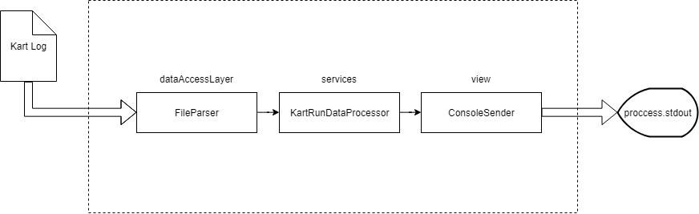

# Gympass

**É necessário o uso do NodeJS v11.0.0 para executar esse script.**

### Para rodar o script

1. Execute `npm install --production` para instalar as dependências
1. Execute `npm start` para rodar o script

### Para rodar os testes do script

1. Execute `npm install` para instalar as dependências
1. Execute `npm test` para rodar os teste unitários do projeto
1. Será criada uma pasta `coverage` na raiz do projeto contendo os dados de cobertura de código do mesmo

--------------------------

### Produção

O script foi criado utilizando Typescript. 

Em um ambiente de desenvolvimento, é possível rodar o script a partir do próprio Typescript, 
utilizando o `ts-node`. 

Porém, para um ambiente de produção, é recomendado buildar o projeto e rodar o script a partir do javascript
gerado. 

Para buildar o projeto:
1. Executar o comando `npm run build`. Isso gerará uma pasta `app`, na raiz do projeto.
1. Executar o comando `node app/index` para rodar o script através do Javascript gerado.

--------------------------

### Estrutura do projeto

O projeto está estruturado conforme o diagrama abaixo:

A escolha por essa arquitetura foi tomada para modularizar a entrada, processamento e saída de dados. 

Dessa forma, caso os dados de entrada sejam alterados, ou os dados venham por outra forma (user input, http request, arquivo .xml, etc), a alteração é pontual e mais simples de resolver do que se o código estivesse acoplado.

De maneira similar, hoje o script tem os dados de saída enviados para o `stdout`. Porém, caso queira enviar os dados por email ou salvar em um arquivo texto, basta alterar o componente ou criar um novo componente de saída.
